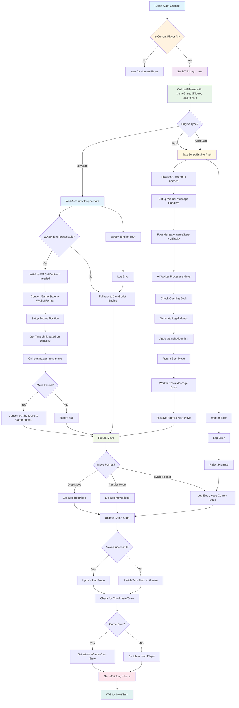

# Computer Player Move Flow Diagram

This diagram shows the complete flow of how a computer player makes a move in the shogi game.

## Key Components

### 1. **Entry Point**
- Triggered when `gameState.currentPlayer` changes to an AI player
- Sets `isThinking = true` to show AI is calculating

### 2. **Engine Selection**
- **WebAssembly Engine (`ai-wasm`)**: High-performance Rust-based engine
- **JavaScript Engine (`ai-js`)**: Traditional JavaScript implementation with Web Worker

### 3. **WebAssembly Engine Flow**
- Converts game state to WASM format
- Sets up engine position
- Calculates time limit based on difficulty
- Calls `engine.get_best_move()` with difficulty level and time limit
- Converts result back to game format

### 4. **JavaScript Engine Flow**
- Uses Web Worker for non-blocking execution
- Checks opening book for known positions
- Generates legal moves
- Applies search algorithms (minimax, alpha-beta pruning)
- Returns best move via worker message

### 5. **Move Execution**
- Handles both regular moves and piece drops
- Updates game state
- Checks for game-ending conditions (checkmate, draw)
- Switches to next player

### 6. **Error Handling**
- WASM engine failures fall back to JavaScript
- Worker errors are logged and handled gracefully
- Invalid moves are logged and turn is switched back

### 7. **State Management**
- Maintains thinking state during AI calculation
- Updates game state after move execution
- Handles turn switching and game progression

## Performance Characteristics

- **WebAssembly Engine**: Fastest, used for high-difficulty play
- **JavaScript Engine**: More flexible, handles complex game logic
- **Web Worker**: Prevents UI blocking during AI calculation
- **Fallback System**: Ensures game continues even if preferred engine fails
